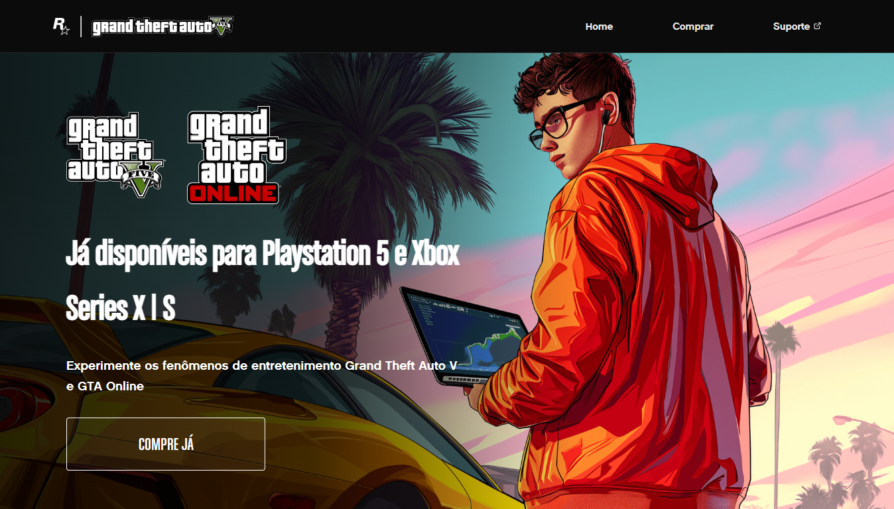
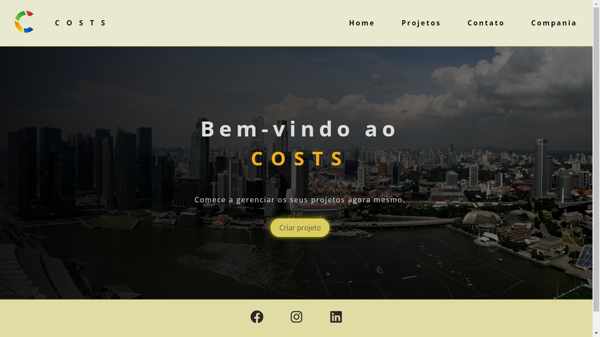

 <h1 align="center">
  💻 Aplicações Front-end
</h1>
<h2>📚 Aplicações</h2>

- <h3>Portfólio pessoal</h3>
<h4><a href="https://anapaulasanto.github.io/Portf-lio/">Clique para visitar o projeto</a></h4>

>Portfólio pessoal.

 

- <h3>IA Salon</h3>
<h4><a href="https://github.com/anapaulasanto/IA-Salon">Clique para visitar o projeto</a></h4>

>Projeto que simula um site de salão de beleza.

 

- <h3>iMovi</h3>
<h4><a href="https://github.com/anapaulasanto/iMovi">Clique para visitar o projeto</a></h4>

>Projeto que simula um site de imobiliária.

 

- <h3>Cadastro e listagem de produtos</h3>
<h4><a href="https://github.com/anapaulasanto/Projeto-study-async">Clique para visitar o projeto</a></h4>

> Aplicação em que é possivel adicionar produtos, excluir, acessar, e exibir os produtos cadastrados, utilizando Python(Django)

 

- <h3>Rockstar Games</h3>
<h4><a href="https://github.com/anapaulasanto/Project-Rockstar-Games">Clique para visitar o projeto</a></h4>

>Aplicação que simula o site da Rockstar - GTA V.

 

- <h3>Audiobook</h3>
<h4><a href="https://github.com/anapaulasanto/Projeto-Audiobook">Clique para visitar o projeto</a></h4>

>Aplicação que simula um audiobook.

 

- <h3>Apple Watch Page</h3>
<h4><a href="https://github.com/anapaulasanto/Projeto-Apple-Watch">Clique para visitar o projeto</a></h4>

>Aplicação que simula uma página do site da Apple.

 

- <h3>Costs</h3>
<h4><a href="https://github.com/anapaulasanto/Costs-Project-ReactJs">Clique para visitar o projeto</a></h4>

>Aplicação que simula um site de criação e gerenicamento de projetos.

 

<h2>💼 Tecnologias utilizadas</h2>

Para o desenvolvimento dessas aplicações foram utilizadas as seguintes tecnologias:

- <h3>JavaScript</h3>

- <h3>React.Js</h3>
 
- <h3>Bootstrap</h3> 

 
<h2> 💻 Autor</h2>

 
  
 <b>Ana Paula</b>

Feito por Ana paula 👋🏽 

 

