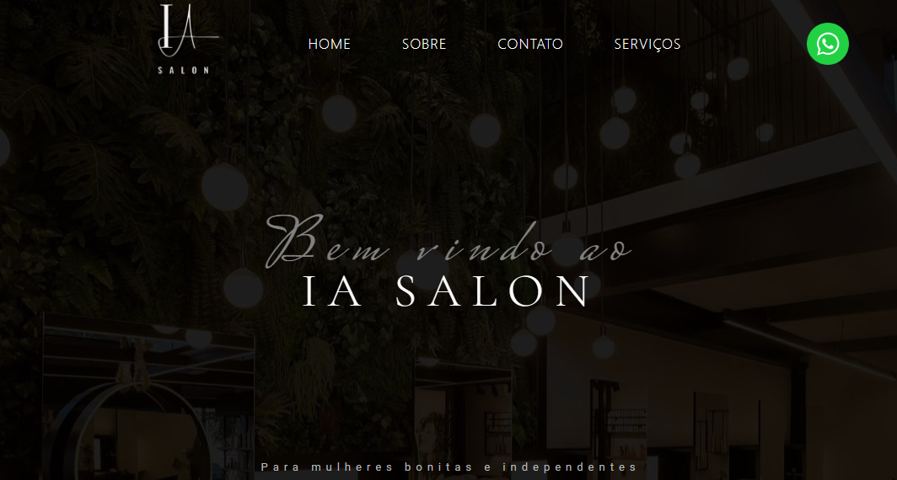
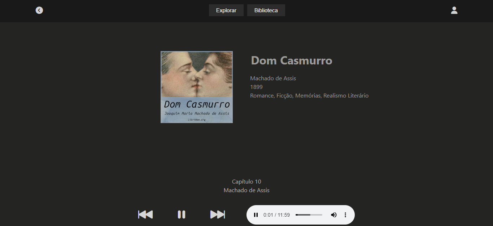
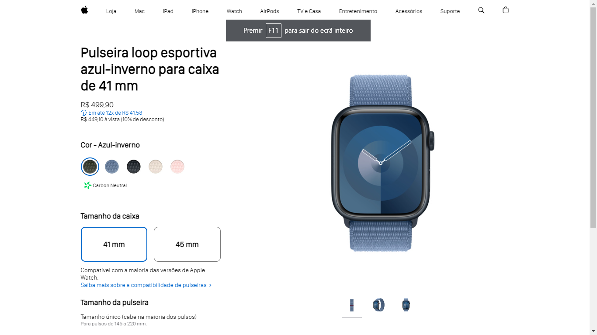
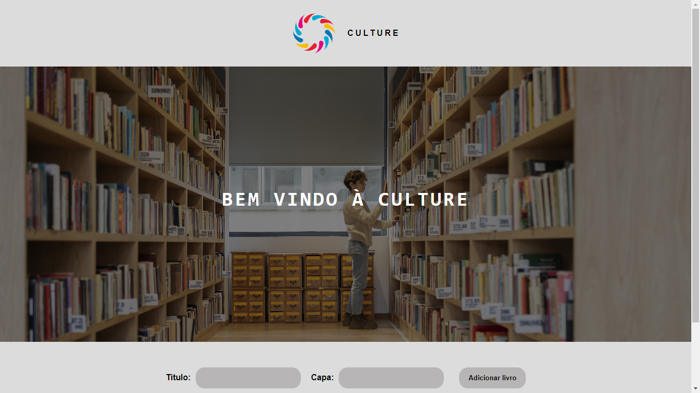
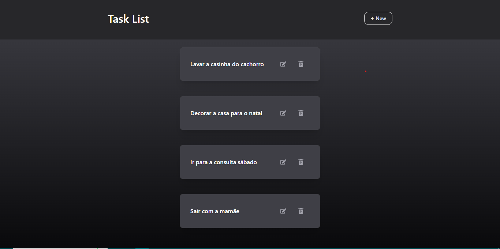
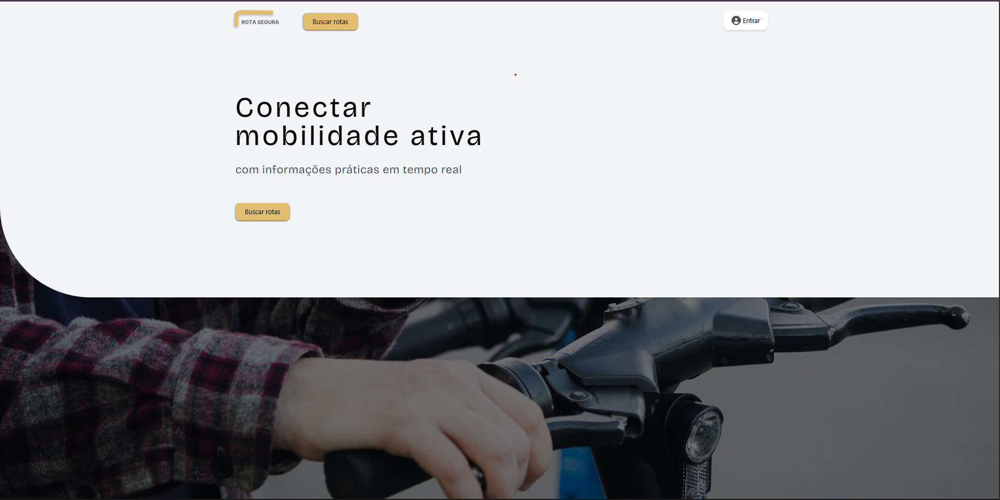
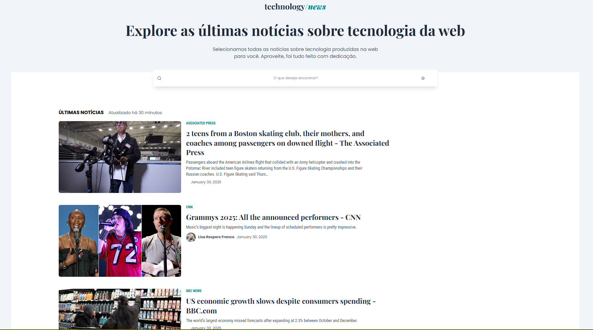
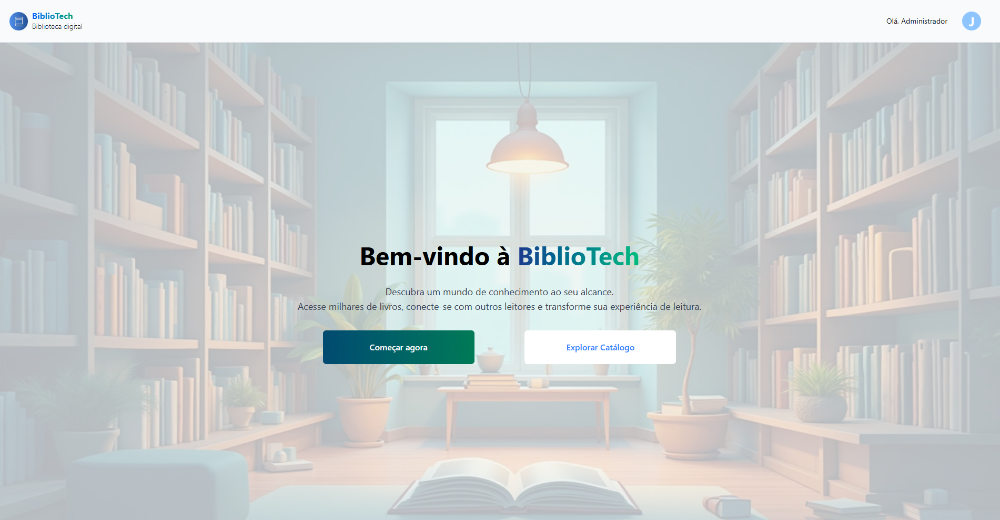

 <h1 align="center">
  💻 Aplicações Front-end
</h1>
<h2>📚 Aplicações</h2>

- <h3>Portfólio pessoal</h3>
<h4><a href="https://anapaulasanto.github.io/Portf-lio/">Clique para visitar o projeto</a></h4>

>Portfólio pessoal.

 

- <h3>Salão de beleza</h3>
<h4><a href="https://github.com/anapaulasanto/IA-Salon/tree/main">Clique para visitar o projeto</a></h4>

> Projeto do IA Salon.

 

- <h3>Audiobook</h3>
<h4><a href="https://github.com/anapaulasanto/Projeto-Audiobook">Clique para visitar o projeto</a></h4>

>Aplicação que simula um audiobook.

 

- <h3>Apple Watch Page</h3>
<h4><a href="https://github.com/anapaulasanto/Projeto-Apple-Watch">Clique para visitar o projeto</a></h4>

>Aplicação que simula uma página do site da Apple.

 

- <h3>Culture library</h3>
<h4><a href="https://github.com/anapaulasanto/library-reactjs">Clique para visitar o projeto</a></h4>

>Aplicação que simula uma biblioteca de livros utitlizando React.Js.

 

- <h3>Todo List</h3>
<h4><a href="https://github.com/anapaulasanto/todo-list/tree/main">Clique para visitar o projeto</a></h4>

>Aplicação de listagem de tarefas.

 

- <h3>Rota Segura</h3>
<h4><a href="https://github.com/anapaulasanto/rota-segura">Clique para visitar o projeto</a></h4>

>Aplicação web full-stack desenvolvida com o objetivo de oferecer uma solução completa e inteligente para o planejamento de rotas em ambientes urbanos.

 

 

- <h3>Technology News</h3>
<h4><a href="https://github.com/anapaulasanto/technology-news">Clique para visitar o projeto</a></h4>

>Aplicação de notícias em que é possível buscar uma notícia e navegar entre elas utilizando a API do News API.

 

 

- <h3>BiblioTech</h3>
<h4><a href="https://github.com/anapaulasanto/public-library/tree/main">Clique para visitar o projeto</a></h4>

>Aplicação moderna para gerenciamento de biblioteca de livros.

 

<h2>💼 Tecnologias utilizadas</h2>

Para o desenvolvimento dessas aplicações foram utilizadas as seguintes tecnologias:

- <h3>JavaScript</h3>
- <h3>React.Js</h3>
- <h3>Bootstrap</h3> 
- <h3>Tailwind</h3> 
- <h3>DaisyUI</h3>
- <h3>Shadcnui</h3> 
- <h3>React Icons</h3> 
- <h3>React Toastify</h3>
- <h3>React Hook Form</h3>
- <h3>React Query</h3>

 
<h2> 💻 Autor</h2>

 
  
 <b>Ana Paula</b>

Feito por Ana paula 👋🏽 

 

