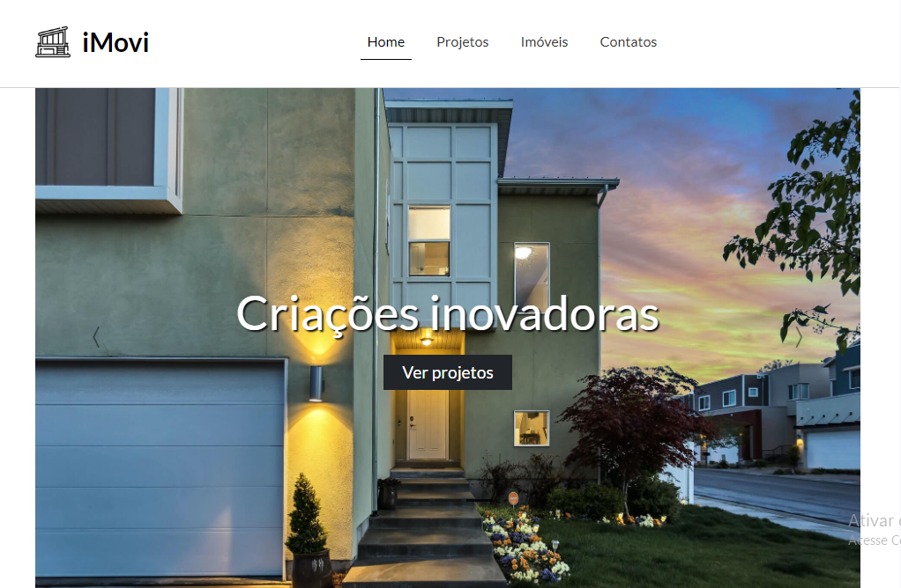

 <h1 align="center">
  💻 Aplicações Front-end
</h1>
<h2>📚 Aplicações</h2>

- <h3>Whitepace</h3>
<h4><a href="https://github.com/anapaulasanto/Whitepace">Clique para visitar o projeto</a></h4>

>Projeto que simula um site de empresa desenvolvedora de sites.

  

- <h3>IA Salon</h3>
<h4><a href="https://github.com/anapaulasanto/IA-Salon">Clique para visitar o projeto</a></h4>

>Projeto que simula um site de salão de beleza.

  

- <h3>iMovi</h3>
<h4><a href="https://github.com/anapaulasanto/iMovi">Clique para visitar o projeto</a></h4>

>Projeto que simula um site de imobiliária.

  

